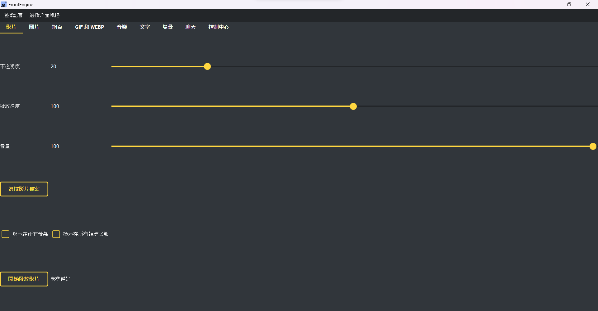

# FrontEngine

[Support this project on Steam](https://store.steampowered.com/app/2793470/FrontEngine/)

## About

FrontEngine is a lightweight and flexible framework designed to simplify automation and visualization tasks.  
It provides an intuitive interface and supports multiple media formats for interactive demonstrations.



---

## Features

- **GIFs & Animations**  
  *(GIFs may take time to load)*  
    
  

- **Video**  
  

- **Website**  
  

- **YouTube Showcase**  
  [Watch on YouTube](https://youtu.be/fewogcb3b8Y)

---

## Desktop pet

Spawn an animated sprite that lives on your desktop, from the **Pet** tab.

- **Sprites** — pick a single GIF/WebP/PNG, or a *pet pack* folder whose file
  names map to states: `walk`, `idle`, `sleep`, `climb`, `fall`, `drag`
  (missing states fall back to `walk`).
- **Behaviour** — walk on the floor with gravity (throw it and it bounces),
  wander freely, or chase the cursor. Floor pets can climb screen edges and
  stand on the top edge of other windows.
- **Life** — mood, fullness and an affection level that persist between runs;
  the pet grows as it levels up, chats in speech bubbles, naps while you are
  away, and warns you about a low battery.
- **Interaction** — drag it around, right-click to clone/feed/set a reminder,
  and **drop a file onto it**: an image or pet pack becomes its new look,
  anything else is eaten. What it eats matters — an archive is a feast, music
  cheers it up more than it fills, a document is a modest meal, and a binary is
  too hard to chew.
- **Tag** — with two or more pets on screen, tick *Play tag with each other* and
  one becomes "it": it walks toward its nearest neighbour while the others run
  the other way, and catching someone passes the tag on.
- **React to audio** — the pet pulses to your speakers' output level. It reads
  only the Windows output *meter* (WASAPI `IAudioMeterInformation`); no audio
  is captured or recorded. Peaks are smoothed with an RMS window and a
  fast-attack/slow-decay envelope so the pulse breathes instead of flickering.
  On multi-monitor setups each pet follows the audio endpoint that matches its
  own screen, falling back to the default output device.

Audio features are Windows-only and degrade to "no pulse" elsewhere.

---

## Focus

Two overlays for when the screen is competing with your work, both on the
**Focus** tab:

- **Dim background windows** — everything except the window you are working in
  is shaded, at an adjustable strength. Off Windows, where the active window
  cannot be identified without a native binding, it shades the whole screen.
- **Cover a distraction** — mask a strip of the screen: the taskbar, a
  notification corner, an edge, or all of it.

Both pass clicks through, so what they cover still works — it just stops pulling
your eye.

---

## Wallpaper

Play a folder of images and animations *beneath* every window, from the
**Wallpaper** tab:

- **A playlist per monitor** — each screen points at its own folder, changes on
  its own timer, and can be shuffled or read recursively.
- **React to audio** — the wallpaper can pulse with your speakers' output level,
  using the same meter-only reading as the pet (no audio is captured).

---

## Widgets

Four desktop widgets on the **Widgets** tab:

- **Audio spectrum** — bars or a ring, log-spaced bands, smoothed with a
  fast-attack/slow-decay follower and peak markers that drift down.
  > Unlike the pet and the wallpaper, which read only the output *meter*, a
  > spectrum needs the actual samples to compute frequencies — so this one
  > **captures the system output stream**. The samples are analysed in memory,
  > never written to disk or sent anywhere, and capture stops the moment you
  > stop the spectrum. Windows only.
- **Now playing** — the current track from Windows' media controls when the
  optional `winsdk` bindings are installed; otherwise the name of the app that
  is actually making sound.
- **System monitor** — CPU, memory and disk as small sparklines. An average
  hides a stall; a line does not.
- **Sticky notes** — editable cards that float above every window and keep
  their text, colour and position between sessions.

---

## Tools

Measuring and capture tools on the **Tools** tab:

- **Colour picker / pixel ruler / protractor** — click to sample or measure;
  the result is copied straight to the clipboard as `#rrggbb`, `rgb(...)`,
  `hsl(...)` or a CSS custom property.
- **Region capture** — drag out an area; it lands on the clipboard and can be
  saved to a file.
- **Pin a window** — keep another program's window on top, or fade it, while
  you work against it. Only stacking and opacity are touched, never window
  content. Windows only.
- **Camera** — your webcam in a circle, rounded box or rectangle, shown
  locally and never recorded.

---

## Rules

Things that decide for themselves, from the **Settings** menu:

- **Smart pause** — stand the overlays down while a fullscreen app is running,
  while the machine is on battery, or while a named app has focus.
- **App profiles** — apply a saved preset when you switch to a given app.
- **Reminders** — every N minutes, or once a day at a set time, shown as a
  toast that closes itself.

The control center also carries a **quality tier** (high / balanced / saver)
that caps every overlay's refresh rate and drops its render resolution.

---

## Screen time, clipboard and layouts

Three things that remember, all of them **off until you switch them on** and
all of them **local — nothing here is ever sent anywhere**:

- **Screen time** (Settings → Screen time) — which apps had focus and for how
  long, with a daily breakdown and a seven-day summary. It pauses while you are
  away from the keyboard, keeps 60 days at most, and **clearing deletes the
  file itself**. While it is off, no file is created at all.
- **Clipboard history** (Settings → Clipboard history) — search what you copied
  and pin the phrases you reuse. Clipboards routinely hold passwords, so this
  is kept **in memory only** unless you separately tick "keep between
  sessions".
- **Window layouts** (Tools tab) — save where every window sits and put them
  back later. Windows are matched by title, and one that is not on screen is
  skipped rather than guessed at. Windows only.

The **Screen care** tab also gains **colour-vision simulation** — protanopia,
deuteranopia, tritanopia and achromatopsia at an adjustable severity, using the
Machado et al. (2009) model. Unlike the other overlays it is opaque, because
showing what someone else sees means repainting the screen rather than tinting
it.

---

## Community content

- **Steam Workshop** — subscribed items are picked up from Steam's own
  `steamapps/workshop/content` folder: presets are imported and pet packs are
  listed with their paths, from **Presets → Import Workshop content**.
  Publishing to the Workshop needs the Steamworks SDK and is not built in.
- **Plugins** — a `plugins/` folder can add its own tabs, either through a
  `FRONTENGINE_TABS` mapping or a `register(registry)` hook.

  > A plugin is Python and runs with the same privileges as FrontEngine — it
  > cannot be sandboxed. Loading is **off by default** (Settings → Load plugins),
  > every load is logged, and one broken plugin is skipped rather than stopping
  > the app. Only install plugins you trust.

---

## Install

- **System Requirements**
  - Python **3.10+**
  - Windows 10/11 is the primary target; macOS and Linux are supported but may need extra OS dependencies.

- **From PyPI**
  ```bash
  pip install frontengine
  ```

- **Pre-built binaries**
  - [GitHub Releases](https://github.com/Intergration-Automation-Testing/FrontEngine/releases)

---

## Development

- Requires **Python 3.10+**.
- Install the dev toolchain:
  ```bash
  pip install -r dev_requirements.txt
  pip install -e .
  ```
- Run the unit smoke tests:
  ```bash
  python ./tests/unit_test/start/start_front_engine.py
  python ./tests/unit_test/start/extend_front_engine.py
  ```
- Contributions and pull requests are welcome!

---

## Continuous Integration & Release

This repository ships two GitHub Actions workflows:

| Workflow | Trigger | Purpose |
|----------|---------|---------|
| `CI` (`.github/workflows/ci.yml`) | Push / PR to `main` or `dev`, daily cron | Matrix smoke test across Python 3.10 / 3.11 / 3.12 on Windows |
| `Release` (`.github/workflows/release.yml`) | A pull request is merged into `main` (or manual dispatch) | Auto-bumps the version in `stable.toml`/`pyproject.toml`, commits the bump back to `main`, swaps `stable.toml` → `pyproject.toml`, builds sdist + wheel, uploads to PyPI as `frontengine` via `twine`, creates a GitHub release tagged `v<version>` |

Publishing **only happens on merge to `main`** — pushing to `dev` runs CI but
never publishes. On merge, the workflow **automatically bumps the patch
segment** of the version (configurable via manual dispatch: `patch` / `minor`
/ `major`), commits the bump back to `main` with `[skip ci]`, then builds,
uploads, and releases under the new version. Both the PyPI upload and the
GitHub release see the bumped version, not the previous one.

### Cutting a new release

1. Merge a pull request into `main` — the patch version bumps automatically.
2. That's it. PyPI publish and GitHub release happen in one workflow run.

For a minor or major bump, trigger the workflow manually via *Actions →
Release → Run workflow* and pick the `bump` segment. That path also works
when you need to re-run a failed publish without a new merge.

### Required repository secrets

| Secret | Used by | Contents |
|--------|---------|----------|
| `PYPI_API_TOKEN` | `release.yml` | A PyPI API token scoped to the `frontengine` project |

The workflow uses `__token__` as the twine username, so only the token itself
needs to be stored.
