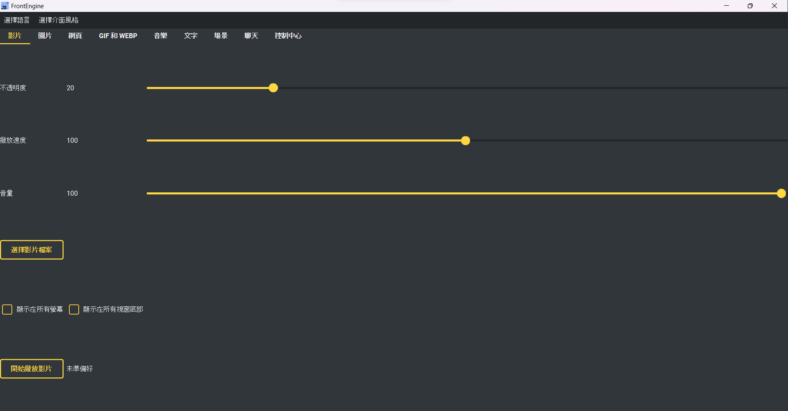

# FrontEngine

<p align="center">
  <a href="../README.md">English</a> ·
  <a href="README_zh-TW.md">繁體中文</a> ·
  <strong>简体中文</strong> ·
  <a href="README_ja.md">日本語</a> ·
  <a href="README_ko.md">한국어</a> ·
  <a href="README_es.md">Español</a> ·
  <a href="README_fr.md">Français</a> ·
  <a href="README_de.md">Deutsch</a> ·
  <a href="README_pt-BR.md">Português (BR)</a> ·
  <a href="README_ru.md">Русский</a>
</p>

[](https://github.com/JeffreyChen-SteamProjects/FrontEngine/actions/workflows/ci.yml)
[](https://pypi.org/project/frontengine/)
[](https://pypi.org/project/frontengine/)

**把任何东西放到屏幕最上层——或者放到它下面。**

FrontEngine 是一款桌面叠加应用。视频、图片、GIF、网页、文字、粒子、声音和一只
会动的宠物，都可以放在所有其他窗口之上（点击穿透，所以下面的东西照样能用），
或者放在它们后面作为动态壁纸。围绕这一切，还有一整套针对屏幕本身的工具：
护眼滤镜、演示批注、测量与截取、专注遮罩和桌面小组件。

[在 Steam 上支持本项目](https://store.steampowered.com/app/2793470/FrontEngine/)
 · [文档](https://frontengine.readthedocs.io/en/latest/)
 · [观看演示](https://youtu.be/fewogcb3b8Y)



---

## 安装

Python **3.10+**。主要目标平台是 Windows 10/11；macOS 和 Linux 也能运行本应用，
平台差异列在[平台支持](#平台支持)一节。

```bash
pip install frontengine

frontengine                    # or: python -m frontengine
frontengine --preset "Work"    # apply a saved preset on launch
```

预编译的 Windows 二进制文件在
[Releases 页面](https://github.com/JeffreyChen-SteamProjects/FrontEngine/releases)，
Steam 版本提供的是同一个应用，并附带创意工坊支持。

> **退出方式。** 叠加层可以覆盖整个屏幕，包括 FrontEngine 自己的窗口，所以有两个
> 不需要鼠标的逃生出口：`Ctrl+Shift+F12` 关闭所有叠加层，而 **F12 会从任何地方
> 直接退出整个应用**（Windows；macOS 需辅助功能权限——见 *Help → How to force close*）。

---

## 它会往屏幕上放些什么

侧边栏按用途把各页面分组。本节沿用这一分组。

### 屏幕上（On screen）

媒体叠加层。每一个都可以挑选它所在的显示器（或横跨全部显示器），记住你把它拖到
哪里，并有各自的不透明度。

- **视频** — 带音量、播放速率和循环。
- **图片** — 单张图片、把一个文件夹当作幻灯片放映，或者一块**参考板**：把多张图片
  放在同一张画布上，每张都可拖动，整块板子可缩放、可平移。
- **网页** — 一个 URL 或一个本地 HTML 文件，可选是否可交互。**仪表盘模式**会在
  一组 URL 之间轮换，这样墙面显示屏就能靠快捷键或计时器循环切换页面。
- **GIF / WebP** — 可调速度的动画。
- **文字** — 字体、颜色、描边、对齐和跑马灯，可显示固定字符串，也可显示**实时来源**：
  时钟、日期、倒计时、秒表、系统负载或天气。这些实时来源接受 `{field}` 模板，
  页面上会列出每一种来源提供的字段。
- **声音** — 音乐播放和低延迟的 WAV 音效。
- **场景（Scene）** — 把上面几种组合成一个由 JSON 文档描述的作品，可以保存和分享。
- **粒子** — 一种 OpenGL 粒子效果。

<details>
<summary>截图（GIF 可能需要一点时间加载）</summary>

| GIF | WebP |
| --- | --- |
|  |  |

| Video | Website |
| --- | --- |
|  |  |

</details>

### 桌面（Desktop）

**桌面宠物** — 一只住在你桌面上的会动精灵。

- **精灵图** — 单个 GIF/WebP/PNG，或一个 *pet pack* 文件夹，其文件名会映射到各种
  状态：`walk`、`idle`、`sleep`、`climb`、`fall`、`drag`（缺失的状态会回退到
  `walk`）。可选的 `pet.json` 用来设定大小、速度，以及它能否攀爬、说话或坐在窗口上。
- **行为** — 在地面上带重力行走（把它抛出去它会弹跳）、自由游荡，或追逐光标。
  地面型宠物会攀爬屏幕边缘，并站在其他窗口的上边缘。
- **生命** — 心情、饱腹度和一个会在多次运行之间保留的好感度。它会随着升级而长大，
  在对话气泡里说话，在你离开时打盹，并在电量偏低时提醒你。
- **交互** — 拖动它，右键点击可以克隆／喂食／设置提醒，还可以**把文件拖到它身上**：
  图片或 pet pack 会变成它的新样子，其他任何东西都会被吃掉。它吃的是什么很重要——
  压缩包是一顿盛宴，音乐带来的开心多于饱腹，文档是一顿普通餐食，二进制文件则太硬嚼不动。
- **抓人游戏（Tag）** — 屏幕上有两只或更多宠物时，勾选 *Play tag with each other*，
  其中一只就成为"它"：它会朝最近的邻居走去，其他宠物则往反方向跑，抓到某个就把
  "它"传出去。
- **对声音有反应** — 宠物会随你音箱的输出脉动，或随你的**麦克风**脉动，这样你说话时
  它就会动。两者都只读取输出*电平表*——一个数字，不是音频。峰值会用 RMS 窗口以及
  快起慢落的包络加以平滑，让脉动像呼吸一样，而不是闪烁。当有多台显示器时，每只宠物
  会跟随与它所在屏幕相匹配的音频端点。
- **专注计时器** — 同一个页面上的番茄钟，由宠物播报：它会告诉你专注何时结束、
  休息何时结束。
- **聊天** — 当设置了 `ANTHROPIC_API_KEY` 时，宠物可以通过 Claude 回答你。默认关闭，
  除非你启用它；见[哪些内容会离开本机](#哪些内容会离开本机)。

**壁纸** — 在所有窗口*下方*播放一个装有图片和动画的文件夹。每台显示器指向它自己的
文件夹，有各自的计时器，可打乱顺序或递归读取，还能随音箱电平脉动。第二个文件夹
可以在安静时段接管。

**小组件（Widgets）** — 坐在桌面上的四样东西：

- **音频频谱** — 条形或环形，对数间隔的频段，用快起慢落的跟随器加以平滑，还有
  会缓缓下落的峰值标记。
- **正在播放** — 当装好可选的 `winsdk` 绑定时，显示来自 Windows 媒体控件的当前
  曲目；否则显示实际正在发声的那个应用的名字。
- **系统监视器** — 把 CPU、内存、磁盘、电池和网络吞吐量显示成小小的迷你折线图；
  勾选你想要的那几条线。平均值会掩盖卡顿，一条线不会。隐藏的线仍在持续记录，
  所以重新打开它时会显示这期间发生了什么。
- **便签** — 位于所有窗口之上的可编辑卡片，会在会话之间保留它们的文字、颜色和位置。

### 工作（Work）

**专注（Focus）** — 当屏幕与你的工作争抢注意力时用的两种叠加层。*调暗背景窗口*会
把除你正在使用的窗口之外的一切都变暗，强度可调。*遮住干扰*会遮盖屏幕上的一条区域：
任务栏、一个通知角落、一条边缘,或者整块屏幕。两者都会让点击穿透，所以它们所覆盖的
东西照样能用——只是不再抢走你的视线。

**护屏（Screen care）** — 用于长时间盯着屏幕的场景：

- **颜色滤镜** — 从暖色经琥珀色、玫瑰色到灰色的七种色调，强度可调。
- **阅读标尺** — 把页面调暗，留下一条跟随光标的明亮条带。
- **休息提醒** — 20-20-20 法则，在间隔到时弹出一个休息叠加层。
- **色觉模拟** — 红色盲、绿色盲、蓝色盲和全色盲，严重程度可调，使用 Machado 等人
  （2009）的模型。与其他叠加层不同,这一个是不透明的，因为要呈现别人所看到的样子
  意味着要重绘屏幕，而不是给它染色。

**演示（Presenting）** — 用于演示、教学和录制：

- **批注** — 用笔、荧光笔或橡皮擦在屏幕上画，支持撤销和清除。
- **光标效果** — 指针周围的一圈光环、点击时的一道涟漪，以及把其余部分调暗的聚光灯。
- **按键显示** — 显示你刚按下了什么，以及你点击了哪个鼠标按钮，让观众能跟上；
  它会在几秒后淡出。可以挑选面板的位置和文字大小，也可以单独关掉鼠标点击的显示。
- **放大镜** — 光标周围区域的放大视图。
- **白板** — 一块无限画布：拖动平移，滚动缩放，保存你画的内容。笔迹存放在画布坐标里，
  所以平移和缩放之后它们仍留在该在的地方。
- **冻结** — 把某台显示器的当前画面钉住，这样你就能在一张静止图像后面继续工作。
  `Ctrl+Shift+F7` 会释放它，这一点很重要，因为冻结的图像盖住了本该用来释放它的按钮。

**工具（Tools）** — 测量、截取和窗口处理：

- **取色器 / 像素标尺 / 量角器** — 点击即可采样或测量；结果会直接以 `#rrggbb`、
  `rgb(...)`、`hsl(...)` 或一个 CSS 自定义属性的形式进入剪贴板。
- **区域截取** — 拖出一块区域；它会落到剪贴板上，可以保存成文件，或者作为一份可缩放的
  浮动副本**钉**在最上层。
- **录制区域** — 录制：框选范围后，先选择输出 GIF 或 AVI 才开始捕获；取消不会启动录制。影格由后台线程逐张写入，队列上限为三张与 64 MiB，单张超限会拒绝。队列已满时跳过捕获，并保留实际经过的播放时间。仍保留帧率、时长、影格数上限与摄像头画中画。停止后异步完成写入，只有成功时才原子替换目标；取消与写入失败会清除临时文件，保留已有目标文件。
- **摄像头** — 把你的网络摄像头显示成圆形、圆角框或矩形，仅在本地显示，绝不录制。
  任何视频输入都能用，包括采集卡，而且设备列表无需重启就会刷新，因为采集卡通常是在
  应用已经运行时才插上的。
- **虚拟摄像头** — 把一块区域（连同上面所有叠加层）作为一个摄像头发出去，让 Zoom、
  Teams 或 Discord 能把它选作视频源。需要可选的 `pyvirtualcam` 包和一个虚拟摄像头
  驱动（OBS 会装一个）；两者缺一时，按钮会明说，而不是悄无声息地失败。
- **读取文字** — 画面文字：Tools → Read text 优先使用本机 OCR：Windows 的 Windows.Media.Ocr、macOS 的 Vision，或已安装且具有语言数据的 Tesseract 可执行文件。本机提取文字不需要云端同意或 ANTHROPIC_API_KEY；成功但没有文字时不会上传截图。翻译与提问只有在另行同意发送文字且提供密钥时，才会将识别文字发送至 Anthropic。本机失败后的截图回退需要独立的画面发送同意与密钥。结果会显示后端及错误，也能撤回同意。
- **钉住窗口** — 在你对着另一个程序的窗口工作时，把它保持在最上层，或者把它变淡。
  只会改动层叠顺序和不透明度，绝不触碰窗口内容。
- **窗口副本** — 另一个窗口的一份小小的、始终置顶的实时拷贝，这样你就能在渲染或聊天
  被埋在下面时看着它。
- **窗口布局** — 保存每个窗口的位置，稍后再把它们放回去。窗口按标题匹配；一个不在
  屏幕上的窗口会被跳过，而不是靠猜。

---

## 一次性控制一切

**控制中心**页面能触及每一个页面上的每一个叠加层，不管它是从哪个标签页打开的：
隐藏、显示、关闭、静音、锁定、重置位置、逐级调整不透明度，以及应用一个**质量档位**
（高 / 平衡 / 省电），它会限制每个叠加层的刷新率并降低它的渲染分辨率。它还带有一个
供 OBS 使用的色度键背景、一个 *Hide from capture* 开关、日志面板，以及**钉到当前
桌面**——切换虚拟桌面时叠加层会让开，回来时再回来。取消钉住会把它收起来的东西都
带回来。

默认的全局快捷键，全部可以在 **Settings → Hotkeys** 里重新绑定：

| Shortcut | Action |
| --- | --- |
| `Ctrl+Shift+F12` | 关闭所有叠加层 |
| `Ctrl+Shift+F11` / `F10` | 隐藏 / 显示所有叠加层 |
| `Ctrl+Shift+F9` | 全部静音 |
| `Ctrl+Shift+↑` / `↓` | 不透明度增 / 减 |
| `Ctrl+Shift+L` | 锁定或解锁（点击穿透 vs 可拖动） |
| `Ctrl+Shift+→` | 下一个仪表盘页面 |
| `Ctrl+Shift+F8` | 在屏幕上显示快捷键一览表 |
| `Ctrl+Shift+F7` | 冻结 / 解冻屏幕 |
| `Ctrl+Shift+F6` / `F5` / `F4` | 媒体播放/暂停、下一首和上一首 |
| `Ctrl+Shift+F3` | 把前景窗口移到下一台显示器 |
| `F12` | 立即退出（Windows / macOS*） |

媒体传输发出的是系统媒体键，所以它能到达任何监听这些键的播放器。移动窗口时会保持
它的比例，而不是把它甩到对面去，后者正是 Windows 自带的 `Win+Shift+Arrow` 的做法。

同样的这些动作——而且仅限于这些——就是远程控制所驱动的内容：

- **你的手机**（Settings → Remote control）— FrontEngine 会在你的本地网络上提供
  一个小页面；在手机上打开那个链接，上面的按钮就会驱动这些动作。
- **一个 MIDI 控制器** — 按 Learn，转动旋钮或按 pad 即可绑定。Windows 使用内置 winmm；macOS 通过 macos extra 使用 CoreMIDI。旋钮到顶端只触发一次，放开 pad 不算再次按下。

---

## 预设和自动化

**预设**一次性捕获每个页面的设置。可以从 **Presets** 菜单里保存、加载、删除、导出和
导入它们，在启动时应用某一个，或者自动恢复上一次会话。一个预设可以导出成一个**包**
——一个装着它所引用媒体的 zip——这样它就能在一台没有那些文件的机器上打开。

接下来是一些会自己做决定的东西，全都在 **Settings** 菜单里。智能暂停是唯一一个一开始
就打开的；其他所有的都要你亲手打开才启用。

| | |
| --- | --- |
| **规则（Rules）** | *"当这些条件成立时，做这件事。"* 把一个星期几、一个时间窗口和哪个应用处于焦点组合起来，然后应用一个预设、隐藏/显示/关闭叠加层，或者设定质量。空白条件表示"任意"，而一条规则会在它的条件开始成立时运行**一次**，而不是在条件持续成立期间反复运行。这是唯一一处条件可以组合的地方；下面各行各自只认得单独一种。 |
| **智能暂停** | 在一个全屏应用运行时、机器靠电池供电时，或某个指定的应用处于焦点时，让叠加层退下。*（默认开启，针对全屏这条规则。）* |
| **应用配置文件** | 当你切换到某个指定的应用时应用一个预设。 |
| **预设日程** | 在选定的星期几、设定的时间应用一个预设。 |
| **主题日程** | 按时钟在白天主题和夜间主题之间切换。 |
| **数字标牌模式** | 在把主窗口收起来的情况下，按计时器轮换一组预设，适合一台一直运行当作显示屏的机器。 |
| **屏保** | 在空闲达到阈值后，弹出你所选择的视频 / 图片 / GIF / 粒子 / 网页，并在你回来时把它撤下。 |
| **提醒** | 每 N 分钟一次，或每天在设定的时间一次，以一个会自行关闭的通知条形式显示。 |
| **保持唤醒** | 在叠加层开着时阻止显示器进入睡眠。 |
| **随系统启动** | 登录时启动。 |
| **屏幕使用时间** | 哪些应用曾处于焦点、各处于多久，带有每日细分和一份七天汇总。它会在你离开键盘期间暂停，最多保留 60 天，而清除会把文件本身删掉。 |
| **剪贴板历史** | 搜索你复制过的内容，并钉住你会重复使用的短语。剪贴板经常装着密码，所以这一项**仅保留在内存中**，除非你另行勾选"在会话之间保留"。 |

---

## 语言

七种：English、繁體中文、简体中文、Deutsch、Русский、Français、Italiano。

从 **Language** 菜单里选一种，界面就会**立即**改变——无需重启。你原本打开的一切都会
保持打开：叠加层继续运行，每个页面上的设置都保持原样。在 Steam 安装的版本上，
首次启动会跟随 Steam 客户端自己的语言。

---

## 隐私与平台说明

### 哪些内容会离开本机

FrontEngine 里的一切都是本地的，除非它在这份列表上。总共有四个例外，全部需要你主动选择开启：

| Feature | Where it goes | Guard |
| --- | --- | --- |
| **读取文字**（工具） | Anthropic API | 画面文字：Tools → Read text 优先使用本机 OCR：Windows 的 Windows.Media.Ocr、macOS 的 Vision，或已安装且具有语言数据的 Tesseract 可执行文件。本机提取文字不需要云端同意或 ANTHROPIC_API_KEY；成功但没有文字时不会上传截图。翻译与提问只有在另行同意发送文字且提供密钥时，才会将识别文字发送至 Anthropic。本机失败后的截图回退需要独立的画面发送同意与密钥。结果会显示后端及错误，也能撤回同意。 |
| **宠物聊天** | 你的消息会发送到 Anthropic 的 API | 同一个密钥、同一条规则；默认关闭。 |
| **天气**（文字来源） | 坐标会发送到 Open-Meteo | 无密钥、无账号、无可识别身份的数据；只有你作为位置输入的内容。 |
| **手机远程** | HTTPS | 手机控制：Settings → Remote control 只提供 HTTPS，令牌每次启动都会更换，可执行动作采用固定列表。手机不会自动信任本机自签名证书。请先导出公开证书，比对显示的 SHA-256 指纹，再依手机或浏览器设置导入或信任。私钥留在用户数据目录。IP 更改、到期或重新生成证书时，可能需要信任新证书。TLS 启动失败不会退回 HTTP。 |

音频功能只读取一个输出**电平表**——一个单一的数字——只有频谱是例外，它需要真实的
采样来计算频率，因此会捕获系统的输出流。那些采样是在内存中分析的，绝不写入磁盘或
发往任何地方，而且你一停止频谱，捕获就立刻停止。

插件：启用加载不代表授权插件。plugin.json 或单文件 sidecar 声明版本、身份、入口与能力；Python import 前检查同意，授权绑定内容摘要。程序或声明改变就需重新同意；旧插件需明确完全信任。Settings → Revoke plugin grants 可撤销保存的授权；已在运行的程序需重新启动才能卸载。Python 插件仍具有完整应用程序权限，声明与同意不是操作系统沙箱。

### 屏幕共享隐私

你的叠加层是给你看的，不是给你正在与之共享的那些人看的。从 **Settings →
Screen-sharing privacy**，FrontEngine 可以在会议应用打开时把它们从捕获中排除出去：

- **它们仍留在你自己的屏幕上。** 只有被捕获的那份拷贝是空白的——这用的是 Windows 的
  `WDA_EXCLUDEFROMCAPTURE`，一个会议应用和录制软件都会遵守的操作系统级标志。
- **遮罩是例外。** 干扰遮罩的存在就是为了盖住某样东西，所以它会故意在捕获里保持可见。
- **触发靠的是你的列表。** Windows 没有一个可靠的"我是否正在被捕获" API，所以它会
  监视你指定的那些窗口标题——这也能抓住在浏览器标签页里开的会，那种情况下可执行文件
  只不过是浏览器而已。

控制中心里也有一个手动的 *Hide from capture* 按钮。

> 这是隐私，不是安全：它击败的是普通的捕获路径，而且它从不对坐在桌前的那个人隐藏
> 任何东西。

### 平台支持

这里没有列出的一切在三个平台上都能用。

| Feature | Windows | macOS | Linux |
| --- | :---: | :---: | :---: |
| 一般覆盖层与界面 | ✅ | ✅ | ✅ |
| 系统音频、频谱与麦克风 | ✅ | backend* | — |
| 正在播放的曲目信息 | ✅ | — | — |
| 窗口几何、布局与跨屏移动 | ✅ | backend* | — |
| 实时窗口副本 | ✅ | backend* | — |
| 其他窗口强制置顶／不透明度 | ✅ | — | — |
| 捕获时排除覆盖层 | ✅ | — | — |
| MIDI 控制 | ✅ | backend* | — |
| 媒体操作键 | ✅ | backend* | — |
| 虚拟桌面／Space 指定 | ✅ | — | — |
| F12 紧急退出 | ✅ | backend* | — |
| 宠物站在其他窗口上 | ✅ | backend* | wmctrl |

* macOS 标为 backend 的项目需要 macos extra、macOS 13+ 与对应权限。这表示已实现公开 framework 路径，并非已在本 Windows 环境完成 macOS 实机验证；见下方运行环境说明。

在某个功能无法工作的地方，按钮会明说，而不是悄无声息地失败。

---

## 运行环境、隐私与互通

录制：框选范围后，先选择输出 GIF 或 AVI 才开始捕获；取消不会启动录制。影格由后台线程逐张写入，队列上限为三张与 64 MiB，单张超限会拒绝。队列已满时跳过捕获，并保留实际经过的播放时间。仍保留帧率、时长、影格数上限与摄像头画中画。停止后异步完成写入，只有成功时才原子替换目标；取消与写入失败会清除临时文件，保留已有目标文件。

手机控制：Settings → Remote control 只提供 HTTPS，令牌每次启动都会更换，可执行动作采用固定列表。手机不会自动信任本机自签名证书。请先导出公开证书，比对显示的 SHA-256 指纹，再依手机或浏览器设置导入或信任。私钥留在用户数据目录。IP 更改、到期或重新生成证书时，可能需要信任新证书。TLS 启动失败不会退回 HTTP。

画面文字：Tools → Read text 优先使用本机 OCR：Windows 的 Windows.Media.Ocr、macOS 的 Vision，或已安装且具有语言数据的 Tesseract 可执行文件。本机提取文字不需要云端同意或 ANTHROPIC_API_KEY；成功但没有文字时不会上传截图。翻译与提问只有在另行同意发送文字且提供密钥时，才会将识别文字发送至 Anthropic。本机失败后的截图回退需要独立的画面发送同意与密钥。结果会显示后端及错误，也能撤回同意。

Puppet 宠物：安装可选的 puppet extra 与可用的 Imervue runtime，再于宠物页选择或拖入原始 Imervue .puppet v1 文件。已有图片与 sprite 宠物包仍可使用。Puppet 宠物使用 Imervue 画布、动作与表情，可复制或关闭，并支持 FrontEngine 覆盖层控制与预设集。可另选 .petscript.json 使用 Imervue 原有脚本引擎；FrontEngine pet.json 宠物包不是 puppet 文件。未知版本、不安全的归档路径与无效资源会在加载 runtime 前拒绝。

场景：场景页支持旧 entry mapping JSON、有版本的 frontengine.scene envelope，以及便携式 .fescene 包。PUPPET 项目可设置位置、大小、不透明度、有限数值参数，以及可选动作、表情与脚本。JSON 路径相对于场景文件解析。.fescene 包含引用媒体、原始 .puppet 与可选 .petscript.json，可移到其他电脑。导入会检查路径、符号链接、版本与解压上限。FrontEngine 场景保持为场景包；.puppet 保持为单一 Imervue 角色。

macOS：可选 macos extra 以 macOS 13+ 与公开 PyObjC framework 为基准。后端提供 ScreenCaptureKit 屏幕／窗口捕获与系统音频、麦克风捕获、Quartz 窗口几何、Accessibility 窗口布局与移动、CoreMIDI、媒体键及 F12 退出。屏幕录制、辅助功能与麦克风权限分别检查；请到系统设置 → 隐私与安全性，依提示重新启动。其他程序窗口的透明度／强制置顶、Space 指定，以及让其他程序捕获时排除覆盖层仍不可用。本 Windows 开发环境尚未验证 macOS 原生授权、硬件与性能。 Settings → macOS 权限与能力会逐项列出可用、不可用或不支持，并显示权限或安装原因。

插件：启用加载不代表授权插件。plugin.json 或单文件 sidecar 声明版本、身份、入口与能力；Python import 前检查同意，授权绑定内容摘要。程序或声明改变就需重新同意；旧插件需明确完全信任。Settings → Revoke plugin grants 可撤销保存的授权；已在运行的程序需重新启动才能卸载。Python 插件仍具有完整应用程序权限，声明与同意不是操作系统沙箱。

渲染：Settings → Overlay rendering 可选 Auto、GPU 或 Software，并查看实际后端。GPU 合成器以 OpenGL texture、shader 与 framebuffer 处理图层顺序、变换、不透明度与裁剪；初始化失败时回退软件并显示原因。已有 QPainter 内容仍可能先由 CPU 转成光栅图再上传；web／video／原生 widget 可能使用独立窗口。捕获与录制可能将 GPU 画面读回 CPU，这不代表零拷贝捕获或已测得性能提升。

Windows OCR 的 WinRT 投影包包含于 FrontEngine 的一般 Windows 安装；请安装需要的 Windows 识别语言。Tesseract 的可执行文件与训练语言数据需单独安装。可选 puppet extra 会安装 Imervue>=1.0.90；macos extra 安装 macOS 13+ 的公开 PyObjC framework。请使用下列命令。docs/formats/ 提供 puppet、pet.json、petscript 与场景示例。

```bash
pip install "frontengine[puppet]"
pip install "frontengine[macos]"
```

[.puppet / pet.json / .petscript.json / .fescene](../docs/formats/interoperability.md)

---

## 扩展

- **Steam 创意工坊** — 已订阅的项目会从 Steam 自己的
  `steamapps/workshop/content` 文件夹里被拾取：预设会被导入，pet pack 会连同它们的
  路径一起列出，从 **Presets → Import Workshop content** 进入。发布到创意工坊需要
  Steamworks SDK，并未内置。
- **插件** — 一个 `plugins/` 文件夹可以添加它自己的标签页，可以通过一个
  `FRONTENGINE_TABS = {"name": WidgetClass}` 映射,也可以通过一个 `register(registry)`
  钩子。请先阅读上面的信任说明。

---

## 开发

```bash
pip install -r dev_requirements.txt
pip install -e .

python -m pytest tests/ -q          # the whole suite, headless (Qt offscreen)
```

静态检查使用 pyflakes（在 `dev_requirements.txt` 里），一棵干净的代码树什么都不会打印：

```bash
python -m pyflakes frontengine/ exe/ tests/
```

测试套件完全在离屏运行，不需要显示器、声卡或摄像头；任何触及外部世界的东西都接受一个
可注入的来源，从而可以用一个假的来源来测试。

- **架构** — [`architecture_explore.md`](../architecture_explore.md) 绘制了每一个模块、
  分层、叠加层契约和扩展点。在添加一个页面或一个叠加层之前先读它：有好几样东西
  （控制中心注册表、七种语言字典、七棵文档树）必须一起更新，而测试会强制这一点。
- **贡献** — 见 [`CONTRIBUTING.md`](../CONTRIBUTING.md)。每个拉取请求一个功能，
  所有 CI 检查都是绿的。
- **构建 Windows 可执行文件** — `python exe/build_exe.py`
  （Nuitka；加 `--onefile` 得到单个文件）。
- **文档** — Sphinx 源码在 `docs/` 里，以全部七种语言发布到
  [Read the Docs](https://frontengine.readthedocs.io/en/latest/)。

---

## 持续集成与发布

工作沿着 `feature → dev → main` 流动，只有最后一步才发布：

```
feat/xyz  ──PR──►  dev  ──PR──►  main
                    │              │
              CI, no release   CI + release
```

| Workflow | Trigger | Purpose |
| --- | --- | --- |
| `CI` (`ci.yml`) | 推送 / PR 到 `main` 或 `dev`、手动触发，或由 `Nightly` 调用 | 编译、运行单元测试，然后从*那次 checkout* 构建一个 wheel、安装它并启动应用——在 Python 3.10 / 3.11 / 3.12、Windows 上 |
| `Nightly` (`nightly.yml`) | 每日定时任务、手动触发 | 调用 `CI`。日程特意放在这里：GitHub 会在约 60 天无活动后禁用含 cron 的工作流，否则那会连带把 PR 检查也一起弄下线 |
| `Release` (`release.yml`) | 一个**来自 `dev`** 的拉取请求被合并进 `main`，或手动触发 | 提升版本号，带着 `[skip ci]` 把它提交回去，把 `stable.toml` → `pyproject.toml` 对调，构建 sdist + wheel，作为 `frontengine` 上传到 PyPI，创建一个打了 `v<version>` 标签的 GitHub release，并把 `dev` 快进 |

发布**只在 `dev` 合并进 `main` 时**发生。功能落到 `dev` 上不会铸出一个版本，而一次
发布是一个刻意的 `dev → main` 拉取请求。一个误对着 `main` 的功能 PR 仍会合并，但不会
发布——失败的方向是缺一次发布，而不是多一次不想要的发布。

补丁段会自动提升；对于一次次要或主要发布，运行 *Actions → Release → Run workflow*
并挑选段位。那条路径也能重新跑一次失败的发布，而不需要一次新的合并。

版本号存在两个文件里：`pyproject.toml` 是 dev 包（`frontengine_dev`），`stable.toml`
是已发布的那个（`frontengine`）。

需要一个仓库密钥：`PYPI_API_TOKEN`，一个作用域限定在 `frontengine` 项目的 PyPI 令牌。
工作流使用 `__token__` 作为 twine 用户名，所以只需要存储令牌本身。

---

## 许可证

见 [`LICENSE`](../LICENSE)。社区期望写在
[`Contributor_Covenant_Code_of_Conduct.md`](../Contributor_Covenant_Code_of_Conduct.md) 里。

Workshop 内容声明采用版本化格式，使用前会验证；未知的元数据 JSON 不会被当作预设。预设包会拒绝不安全的归档路径、超出资源上限以及媒体文件名冲突。

预设集 → 管理创意工坊打开 Steam 管理界面；场景与宠物页也有入口。Windows x64 需在线 Steam 客户端、App 2793470 会话及 steam_api64.dll。可发布已保存的 .fescene／场景 JSON、预设集 ZIP 或 sprite 宠物文件夹，附小于 1 MB 的 PNG/JPEG 预览。新项目默认为私人，更新核对所有者。上传显示进度与条款状态，保存 ID 供重试，隐藏窗口仍继续；中断后须在 Steam 确认结果。订阅先验证并复制到独立版本文件夹，本地修改冲突可选下载或本地版本。载入填入对应页面，播放从该页启动；预设集导入须用新名称。保留离线文件夹导入。Steam 打包时在 exe/build_exe.py 添加 --steam-runtime DLL路径，DLL 位于可执行文件旁（--onefile 亦同）；不包含 SDK 或开发用 steam_appid.txt。

Windows 安装现在包含 winrt-Windows.Media.Control，让「正在播放」小工具通过 SMTC 显示歌名与演出者；旧 winsdk 仍作备选。无媒体会话时返回空结果，并保留现有音频程序名称备选。

可执行文件构建会在编译前检查所有必要依赖与版本；请先在构建环境安装 requirements.txt。

场景 → 视觉编辑提供图片／GIF／文字图层列表与预览、群组拖动、角落缩放、位置／尺寸／倍率／旋转／顺序／透明度控制、画布对齐、位置锁定、显示、复制及 100 步撤销／重做（Ctrl+Z／Ctrl+Y）。可直接导出便携 .fescene，脚本页也能编辑并应用 JSON。播放还原明确尺寸、倍率、旋转与显示状态。载入／应用外部 JSON 时开始新撤销历史，并保留现有字段。

从菜单栏打开「功能搜索」，或在 FrontEngine 按 Ctrl+K／Ctrl+Shift+P。可搜索当前界面语言、英文名称或固定命令名称；上下键选择，Enter 执行。包括页面导航、截取、便签、护眼滤镜、Workshop 和现有全局动作。预设集／画质动作可输入值。收藏及最近 20 个命令在重启后保留；参数及搜索文字不保存。

文字 → 本机 TXT／JSON／CSV 可选择 UTF-8 文件、字段及 1–3600 秒更新间隔。JSON 字段使用 /键/索引（如 /build/tasks）；CSV 使用唯一列名，所选列逐行显示。字段为空显示整个文件。后台每个来源最多一个读取任务，输入限 1 MiB、输出限 65,536 字符。文件／字段缺失、格式、权限与大小限制有明确状态，修正后自动恢复。预设集保存文件、字段和间隔。便携场景复制所选数据文件，分享包会分享该数据快照。

工具 → 色板管理在勾选「收集颜色」后，通过取色器连续点击收集。可命名、分组、编辑精确色码、搜索、复制及移除，近期采样可复用。本机保存最多 512 个色板及 50 个不同近期颜色，重启后保留。每组名称忽略大小写且不可重复，重复时明确拒绝。CSS／JSON 导出保留 RGB 色值；CSS 变量名冲突加数字后缀。导出完整写入后替换文件。功能搜索也可打开色板管理。

预设集 → 预设集版本跨会话保留每个预设集最多 50 个不同设置快照。保存时记录原配置与新配置，相同内容不重复保存。选择版本可比较与当前页面设置的字段差异；预览会将该配置应用到页面控件，取消预览、Escape 或关闭窗口会恢复原设置。“恢复版本”会应用并保存，若应用或保存失败则还原页面设置。快照只保留媒体路径，不复制媒体；预览不打开覆盖层。现有 JSON／ZIP 预设集保持兼容。历史位于 presets/.versions；删除预设集后历史仍保留，同名重建时可查看。

宠物 → 宠物身份与存档为每只 sprite 或 Puppet 宠物保存独立 UUID、名字、心情、饱足及好感度。重启后在生成前选择已保存身份即可继续状态；“新宠物”建立新状态。第一个身份只迁移一次原共享数值。复制将当前数值复制到新身份，喂食不会改变其他宠物。可重命名、刷新、导出或导入单只 JSON 存档，导入一定建立新身份。同一身份同时只能启用一次。存档不含图片、脚本或对话记录，可移植预设集不写入本地身份 ID。用户设置最多保存 256 个身份；sprite 数值更改稍后合并保存，关闭时也会保存。Puppet 喂食只更新存档数值，不改变 Imervue 动作及尺寸。

图片 → 比较图片在同一缩放／平移视图查看两张参考图，可切换并排、透明叠图、滑动分隔线和 RGB 绝对差。可不缩放对齐左上角或中心，或保持比例将 B 放入 A。滚轮同步缩放；滑块调整 B 透明度或分隔线位置。透明像素和留白以白底比较，差异黑色表示 RGB 相同；动态图只用第一帧。解码、对齐及差异计算在后台运行，一次只处理一个请求并应用最新选择；透明度／分隔线重绘沿用缓存。每文件限 64 MiB、单边最多 8,192 像素，每图及对齐画布最多 16,777,216 像素。新选择失败保留原比较内容，关闭释放图片并忽略迟到结果。

设置 → 规则增加优先数字（-1000…1000）、冷却时间（0…86400 整数秒）、条件预览及本会话执行记录。触发规则从小到大执行，相同数字按表格顺序，较高优先数字最后执行。冷却使用单调时钟，期间触发被消耗并略过，到期时若条件仍成立也不执行。预览检查未保存行，不执行动作或消耗触发。最近 200 条记录保留条件、当时环境及派发／执行／失败／冷却结果，只存在内存。已命名但无效的行阻止保存。最多 200 条，同名规则也有独立身份；编辑保留表格未列出的现有条件。动作回报失败记录为失败，不阻断后续规则。

规则可载入、播放或停止场景，并显示、隐藏、移动指定图层或设置透明度。选择规则行后按“选择场景／图层目标”，可浏览 JSON、.fescene 或 .puppet，选择主屏幕、所有屏幕或编号屏幕，以及当前编辑器图层。播放路径留空时使用当前场景。文件在后台读取；新场景创建失败保留原播放内容。最新场景请求替代之前未完成的请求；之后的图层动作等待载入，载入失败时一并失败。锁定或不存在的图层会被拒绝。图层修改可撤销并同步播放；透明度为 0–100，位置限制为 ±100000。停止会取消待处理请求并关闭播放，编辑素材保留到替换或程序关闭。执行记录反映后台动作的实际结果。命令面板也有这些动作：可填路径或 {"path":"scene.fescene","screen":"primary"}，显示／隐藏填图层键名，透明度填 {"layer":"title","opacity":50}，位置填 {"layer":"title","x":20,"y":30}。

场景 → 脚本 → 情境模板（也可从命令面板打开）提供工作桌面、教学与专注布局，附当前语言的可修改文字。先预览并选择主屏幕或编号屏幕，再按“应用并播放”；布局按屏幕可用逻辑尺寸等比例调整。模板包含所需素材；缺失时列出图层／字段／路径并禁止应用。应用通过场景创建流程替换编辑内容与播放，准备失败保留原场景。之后可修改文字、加入素材，再由场景导出另存 JSON 或可移植 .fescene。关闭模板库只取消自身待处理应用。专注模板提供可修改的提醒文字，计划与计时器仍由各自工具设置。

场景 → 视觉编辑可在图片／GIF／文字之外添加视频、网页、Puppet 和音频。须手动启用实时预览，最多八个来源，默认静音；试听选定媒体才开启声音，隐藏时暂停，停用或关闭时释放资源。帧每边最多 1280 像素，无法预览会显示原因。具名场景播放将视频帧、网页自己的渲染画面及 Imervue 离屏 Puppet 帧按顺序与所有视觉图层合成；音频播放不显示图层。播放时双击网页／Puppet，或在编辑器选择与选定媒体交互，可打开同一个原生输入窗口。Puppet 预览需要原生 OpenGL 和可选运行环境，不执行宠物脚本，场景宠物采用临时状态。独立网页／视频／Puppet 窗口仍可使用。JSON／.fescene 导出保留全部支持类型与素材引用。

工具 → 区域录影可选 GIF 或无声 AVI（Motion JPEG），支持 1–20 fps、暂停／继续及取消。状态显示有效秒数、已接受帧与丢帧数；暂停时间不计入播放及长度限制，暂停中也可停止。AVI 最多一小时、72,000 帧，输出上限 2 GiB；GIF 保留 120 秒／600 帧限制。两者共用三张／64 MiB 的后台队列与原子输出。AVI 只保留一张 JPEG，索引写入磁盘，跳过捕获的时段重复上一帧以保持时间。编码、容量或磁盘失败，以及取消，都保留已有目标文件。不录制音频。

场景 → 视觉编辑 → 动画时间轴可编辑单个未锁定图层的 x／y／透明度关键帧，提供淡入与滑入示例。时间须唯一递增，范围 0–3600 秒，每层最多 128 帧；透明度 0–100、位置 ±100000，缓动可用 linear 或 smooth。空白单元格保留该属性。应用为一笔可撤销编辑，JSON 与便携 .fescene 保留动画。可拖动时间、播放、暂停、继续或重播预览，临时位置不会保存；重置恢复保存配置后再编辑。场景播放另有动画控制，多屏共用单调时钟，隐藏时停止推进；明确暂停不会因重新显示而取消。动画暂停会暂停媒体，重播控制动画轨。场景动作切换以旧合成画面快照淡入淡出 0.5 秒，立即释放旧渲染器，新时间轴从零开始。无动画的旧场景仍兼容。

场景 → 场景独立输出可将当前编辑器场景预览为固定 640×480、1280×720 或 1920×1080 像素，不受桌面位置、遮挡和 DPI 影响。开始预览不打开摄像头；发送至虚拟摄像头才会使用可选 pyvirtualcam 和已安装兼容驱动。设备启动、发送和关闭由单个后台工作执行，仅保留最新待发 RGB 帧，设备较慢时跳过中间帧。输出静音且不含音频。图片／GIF／文字和原生视频／网页／Puppet 按图层顺序合成，音频图层不可见。Puppet 需要可选运行环境和原生 OpenGL；媒体或设备不可用时显示原因。支持最多 256 图层、八个原生媒体来源，图层位图总计 1600 万像素。停止、Escape、关闭对话框／程序或编辑场景都会释放渲染器并请求关闭摄像头；场景编辑后须重新启动。旧素材读取会在场景包租期释放前停止。

宠物 → Sprite 宠物包制作可对应行走／闲置／睡眠／攀爬／落下／拖动图片、预览尺寸与行走速度，导出含 pet.json 的便携文件夹。至少需要一个动作；缺失动作列出提示并使用现有加载器备用。支持 PNG/JPEG/GIF/WebP，每文件上限 64 MiB、1600 万像素，总计 256 MiB。导入／导出在后台执行，可取消且不覆盖现有文件夹。导出后可移动、在宠物页选用或作为 Workshop 宠物包分享。导入只保留选定图片、名称、尺寸与速度，不复制音效、脚本或对话；Imervue .puppet 使用独立制作格式。关闭或 Escape 会释放预览动画并取消文件操作。

工具 → 编辑上次截图以独立副本提供裁切、箭头、编号、文字框与不透明黑色遮盖。在缩放预览上拖动，坐标及输出仍使用图片实际像素。可撤销、重置并查看只读原图。复制、保存 PNG 与固定编辑结果均使用同一份合成结果，即使正在显示原图。遮盖最后绘制，PNG 不包含原图或隐藏图层；上次原始截图仍另存于内存。PNG 采用原子保存。上限为 1600 万像素、1000 个标记、文字框 2000 字、20 个撤销状态。关闭或替换面板会释放文档。

演示 → 白板新增独立可编辑页面、绘画／选择模式、Shift 多选、笔画移动与删除，以及跨页合计 20 个撤销状态。中键平移、滚轮缩放；选择及移动维持画布坐标，每页保留自己的视角。保存／打开可编辑文件使用有版本的 .fewhiteboard JSON，保留矢量笔画与视角，重开后可继续编辑；单一后台任务处理读写验证，失败保留原白板或文件。导出本页 PNG 只合成该页内容，排除控制栏、选择框与视角变换，保留完整笔宽边界。上限：50 页、每页 2000 笔画、总计 100000 点、JSON 8 MiB；PNG 每边 8192 像素及 1600 万像素。关闭／Escape 取消写入并忽略延后的读取结果。

设置 → 图片剪贴板历史独立选择启用，默认关闭；打开窗口不会启用监视或读取剪贴板。应用设置才启用记录与可选的本地 SQLite 跨会话保存。可选 10–200 张、PNG 数据 8–128 MiB；收藏不被容量淘汰，但仍计入两项上限，收藏已满时明确拒收新图。每图上限 1600 万像素、编码 8 MiB。单一后台线程处理压缩、缩略图与数据库，仅保留最新待处理剪贴板图片并合并结果；压缩慢时略过中间图片。缩略图可收藏、删除、清空、复制原始图片、桌面固定及发送到内存参考图板。清空包含收藏并释放保存页面；取消保存会移除本地数据库，当前历史仍留于内存。文件为设置旁的 clipboard-images.sqlite3，数据库上限 132 MiB，SQLite 临时日志可能另占磁盘；不会上传或自动 OCR。关闭程序停止监视并要求后台清理。

工具 → 持续更新 OCR 浮窗将固定所选区域的文字放在旁边，初始采用手动、本地识别。可明确开启 5–60 秒自动刷新，复制当前或历史文字，在内存保留 20 条不重复成功结果；相同或空文字不重复记录。最多四个浮窗、每窗一个识别任务、截图上限 1600 万像素／编码 8 MiB、文字 20000 字；慢速识别略过重复请求。本地模式即使已有全局同意也不调用云端；明确选择云端备用才沿用 ScreenTextService 截图同意与凭证，另提供「查看云端权限」，不自动弹同意窗、不翻译或上传文字。启用备用后每次刷新可能上传所选区域。浮窗重叠区域时拒绝刷新以避免反馈。Windows/X11 使用屏幕相对 Qt 坐标，Mac 异步原生捕获单张后停止流。隐藏停止捕获与计时；关闭／Escape 释放来源、历史并忽略延后结果，不等待后台任务；已发送的外部 API 请求可能仍完成。浮窗纳入覆盖层批量清理，不自动重开捕获。

设置 → 截图历史与搜索须独立启用，打开窗口不会保存或识别。只收工具页明确框选的截图，由后台运行本地 OCR，不监看剪贴板、不转送云端。成功后可搜索识别文字（不区分大小写）；失败仍存图，提示原因。日期输入本地时区 YYYY-MM-DD，留空显示全部。可复制、重新固定、发到参考图板、收藏及删除。跨会话保存使用设置旁的 capture-history.sqlite3，10–200 张／PNG 8–128 MiB，每张 16 MP／编码 8 MiB，主数据库最高 132 MiB，另有临时日志。删除同步移除文字索引，清空含收藏，取消保存移除数据库。仅保留最新一笔等待截图，忙碌时略过中间输入；关闭丢弃等待工作与结果，不等待正在运行的本地识别。
