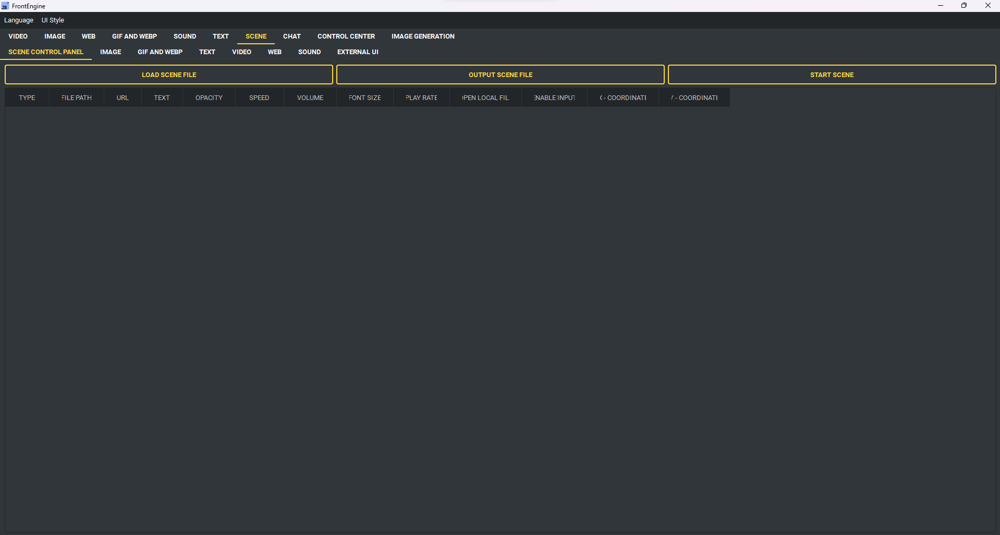

Szenen-Seite
------------

Eine Szene fasst mehrere Overlays zusammen und lässt sich als Datei sichern.

* Webseite zur Szene hinzufügen - Adresse und Deckkraft.
* Video hinzufügen - Datei, Deckkraft, Geschwindigkeit, Lautstärke.
* Bild hinzufügen - Datei und Deckkraft.
* GIF hinzufügen - Datei, Deckkraft, Geschwindigkeit.
* Ton hinzufügen - Datei und Lautstärke.
* Text hinzufügen - Text, Deckkraft, Schriftgröße, Ausrichtung.
* Szene starten - alles Hinzugefügte anzeigen.
* Szenendatei ausgeben - das Gebaute sichern.
* Szenendatei laden - eine gesicherte Szene zurückholen.
* Alle Skripte löschen - von vorn anfangen.
* Auf allen Bildschirmen zeigen - eine Kopie je Monitor.

Szenen: Die Szenenseite liest alte JSON-Eintragslisten, versionierte frontengine.scene-Dokumente und portable .fescene-Pakete. PUPPET-Einträge enthalten Position, Größe, Deckkraft, endliche numerische Parameter sowie optionale Bewegung, Ausdruck und Skript. JSON-Pfade beziehen sich auf die Szenendatei. .fescene enthält die referenzierten Medien, die originale .puppet und optionale .petscript.json für andere Rechner. Import prüft Pfade, symbolische Links, Versionen und Entpackgrenzen. Eine FrontEngine-Szene bleibt ein Szenenpaket; .puppet bleibt eine einzelne Imervue-Figur.

:doc:`runtime_interoperability`

Szene → Visueller Editor bietet Bild/GIF/Text-Ebenenliste und Vorschau, Gruppenziehen, Eckenskalierung, Position/Größe/Skalierung/Drehung/Reihenfolge/Deckkraft, Leinwandausrichtung, Layoutsperre, Sichtbarkeit, Duplizieren und 100 Undo/Redo-Schritte (Ctrl+Z/Ctrl+Y). Portable .fescene direkt exportieren; im Skript-Tab JSON bearbeiten und anwenden. Wiedergabe übernimmt explizite Größe, Skalierung, Drehung und Sichtbarkeit. Externes JSON beginnt eine neue Undo-Historie; vorhandene Felder bleiben erhalten.

Szene → Skript → Szenenvorlagen (auch in der Befehlspalette) bietet Arbeitsdesktop, Unterricht und Fokus mit übersetztem, bearbeitbarem Text. Layout ansehen, Hauptbildschirm oder Bildschirmnummer wählen und Anwenden und abspielen; Proportionen passen in dessen nutzbare logische Größe. Vorlagen enthalten alle Ressourcen. Fehlende Ressourcen werden mit Ebene/Feld/Pfad aufgeführt und verhindern Anwendung. Der Szenentransaktionsablauf ersetzt Editor und Wiedergabe; fehlgeschlagene Vorbereitung erhält die bisherige Szene. Text ändern, Medien ergänzen und als JSON oder portable .fescene exportieren. Schließen der Bibliothek bricht nur ihre ausstehende Anwendung ab. Fokus enthält bearbeitbare Erinnerungstexte; Zeitpläne und Timer bleiben eigene Werkzeuge.

Szene → Visueller Editor ergänzt Video, Web, Puppet und Audio zu Bild/GIF/Text. Live-Vorschau ausdrücklich aktivieren: bis zu acht Quellen, stumm bis zum Anhören, verborgen pausiert, bei Deaktivierung/Schließen freigegeben. Bilder sind auf 1280 Pixel je Seite begrenzt; Fehler werden angezeigt. Benannte Szenen komponieren Videobilder, die eigene Web-Oberfläche und Imervue-Offscreen-Puppet-Bilder mit allen visuellen Ebenen in z-Reihenfolge; Audio ist unsichtbar. Doppelklick bei Wiedergabe oder Interagieren im Editor öffnet dasselbe native Web/Puppet-Eingabefenster. Puppet braucht natives OpenGL und die optionale Laufzeit; Vorschau führt keine Haustierskripte aus, Szenentiere verwenden temporäre Werte. Einzelne Web/Video/Puppet-Fenster bleiben verfügbar. JSON/.fescene erhält alle unterstützten Typen und Medienreferenzen.
