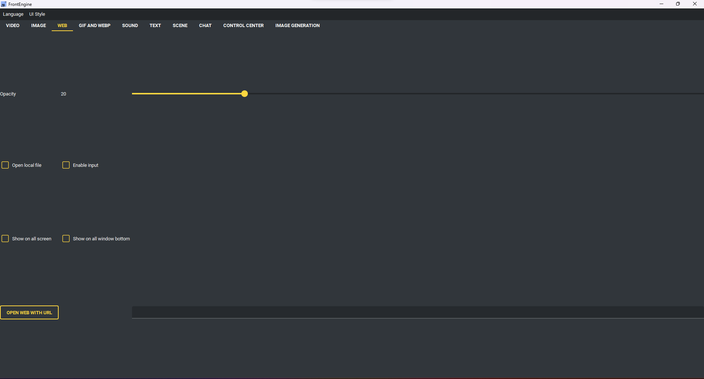

Webseiten-Seite
---------------

* Webseite mit URL öffnen - die Adresse aus dem Feld anzeigen.
* Lokale Datei öffnen - das Feld als Pfad zu einer lokalen html-Datei lesen.
* Eingabe erlauben - der Seite Klicks und Tastatur zugestehen.
* Deckkraft - wie durchsichtig die Seite ist.
* Zoom - von 50% bis 200%.
* Automatisch aktualisieren - alle 30 Sekunden bis alle 15 Minuten neu laden.
* Dashboard-URLs - eine Adresse pro Zeile; Zeilen mit # werden übersprungen.

    * Dashboard starten - der Reihe nach durchwechseln.
    * Nächste Seite - sofort weiterschalten.

* Auf allen Bildschirmen / Unter allen Fenstern / Zielbildschirm - wie sonst auch.
