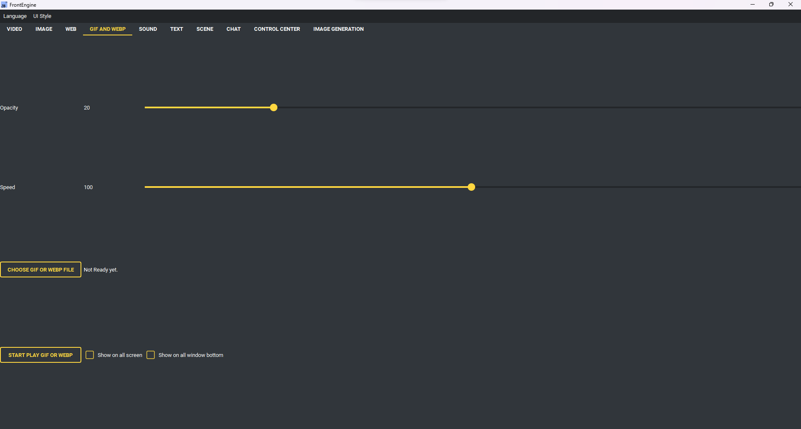

GIF & WEBP Page
----

* GIF and webp tab have below option:
    * Opacity: GIF or webp opacity
    * Speed: Gif play rate percentage
    * Show on all screen (Show image on all screen)
    * Show on all window bottom (Image will hide on all window bottom)
* Buttons
    * Choose GIF or webp file (Choose .gif or .webp file)
    * Start play gif or web (read options and start play gif or webp)
