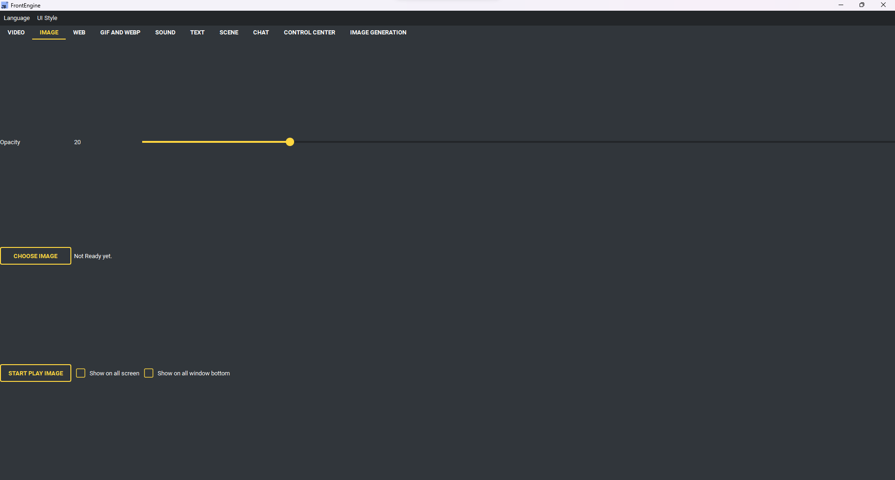

Image Page
----

* Image tab have below option:
    * Opacity: Image opacity
    * Show on all screen (Show image on all screen)
    * Show on all window bottom (Image will hide on all window bottom)
* Buttons
    * Choose Image (use to choose image you want to play .jpg .png . webp)
    * Start play image (read options and start play image)