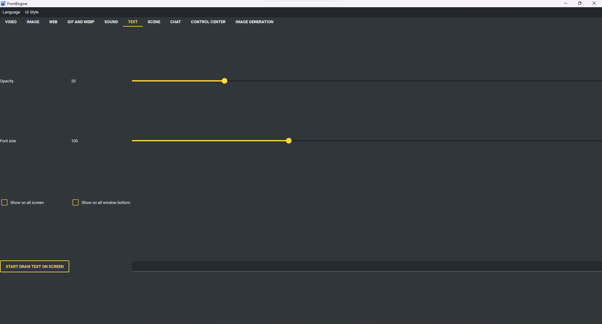

Text Page
---------

* Start draw text on screen - show the text.
* Opacity - how see-through the text is.
* Font size, Font, Color - how it looks.
* Outline - draw a contrasting edge so it stays readable over anything.
* Choose text alignment - which corner or the centre.
* Marquee - scroll the text sideways, with its own speed.
* Text source - where the words come from.

    * Static text - exactly what is in the box.
    * Clock / Date - a strftime format.
    * Countdown - minutes, HH:MM, or a full date.
    * Stopwatch - counts up from the moment it starts.
    * System stats - fields such as {cpu} {ram} {disk} {down} {up}.
    * Weather - fields such as {temperature} {description} {humidity} {wind},
      for the city named in Weather city.

* Show on all screen / Show on all window bottom / Target monitor - as elsewhere.
