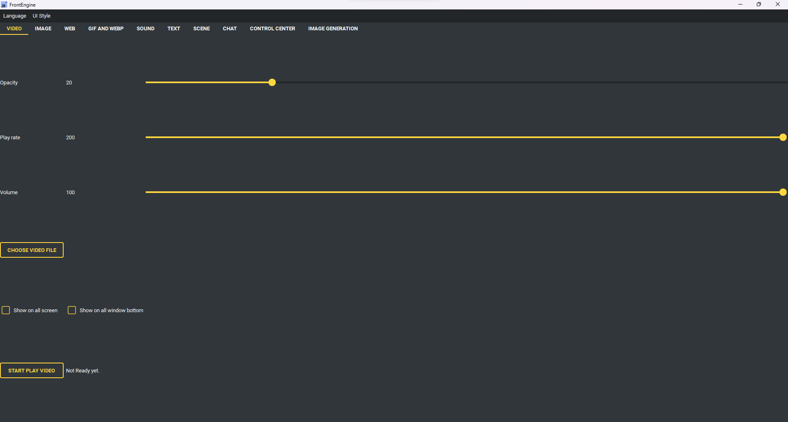

Video Page
----

* Video tab have below option:
    * Opacity: Video opacity
    * Play rate: Video play rate percentage (100 = 100%)
    * Volume: Video volume percentage (100 = 100%)
    * Show on all screen (Show video on all screen)
    * Show on all window bottom (Video will hide on all window bottom)
* Buttons
    * Choose video file (use to choose video you want to play)
    * Start play video (read options and start play video)