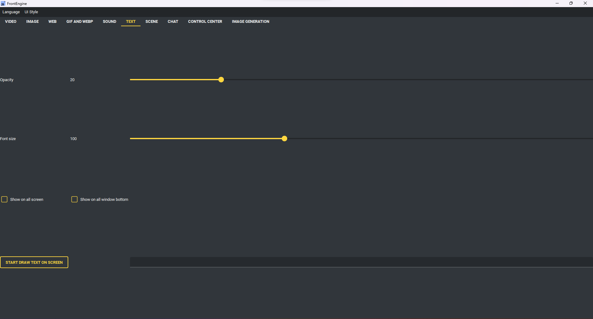

Page Texte
----------

* Afficher le texte à l'écran.
* Opacité - à quel point le texte est translucide.
* Taille, police, couleur - son apparence.
* Contour - un liseré contrasté pour rester lisible sur n'importe quel fond.
* Alignement du texte - vers un coin ou au centre.
* Défilement - faire glisser le texte sur le côté, à sa propre vitesse.
* Source du texte - d'où viennent les mots.

    * Texte fixe - exactement ce qui est dans le champ.
    * Horloge / Date - un format strftime.
    * Compte à rebours - minutes, HH:MM, ou une date complète.
    * Chronomètre - compte à partir du démarrage.
    * État du système - des champs comme {cpu} {ram} {disk} {down} {up}.
    * Météo - des champs comme {temperature} {description} {humidity} {wind},
      pour la ville indiquée dans « Ville pour la météo ».

* Tous les écrans / Sous toutes les fenêtres / Écran cible - comme ailleurs.

Texte → TXT / JSON / CSV local affiche un fichier UTF-8 avec champ et intervalle de 1–3600 secondes. JSON : /clé/index (ex. /build/tasks) ; CSV : en-têtes uniques, colonne affichée par lignes. Champ vide : fichier entier. Lecture en arrière-plan, une tâche par source, limite 1 MiB et 65 536 caractères. Les erreurs de fichier/champ, format, accès et taille sont explicites ; la correction rétablit automatiquement le résultat. Les préréglages gardent fichier/champ/intervalle. Une scène portable copie le fichier : partager le paquet partage cet instantané.
