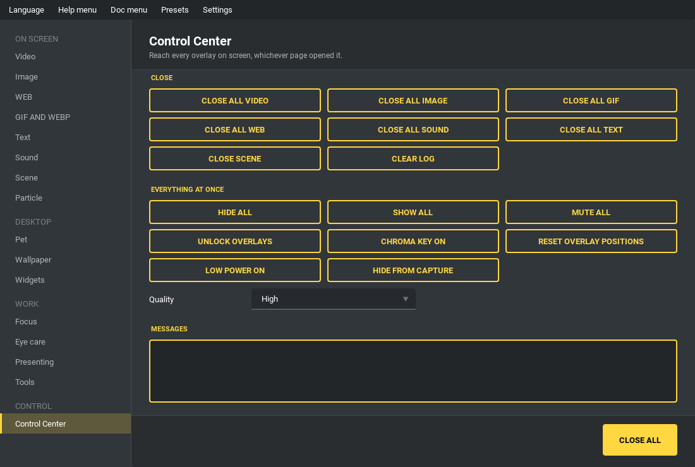

Pagina Centro di controllo
--------------------------

Una pagina che raggiunge ogni overlay, compresi quelli aperti dalle altre
pagine.

Chiusura

* Chiudi tutti i video / immagini / GIF / pagine / suoni / testi - solo quel tipo.
* Chiudi tutto - ogni overlay sullo schermo, da qualunque pagina sia stato aperto.
* Cancella il log - svuotare l'area dei messaggi a destra.

Tutto insieme

* Nascondi tutto / Mostra tutto - metterli via un momento e riprenderli.
* Disattiva tutto l'audio - far tacere tutto ciò che suona.
* Blocca / sblocca gli overlay - sbloccati si trascinano col mouse dove si vuole
  e ricordano dove sono stati lasciati; bloccati lasciano passare i clic.
* Chroma key - dipingere lo sfondo di un colore pieno per la chiave in OBS e
  simili.
* Reimposta la posizione degli overlay - rimettere tutto dov'era all'inizio.
* Risparmio energetico - abbassare frequenza e risoluzione quando conta la
  batteria.
* Qualità - Alta, Bilanciata o Risparmio: la stessa idea, più fine.
* Nascondi dalla cattura - gli overlay restano sul tuo schermo ma spariscono da
  ciò che registra una condivisione. Solo su Windows. Una copertura della pagina
  Concentrazione resta visibile, dato che coprire è la sua unica ragione d'essere.
* Fissa a questo desktop - gli overlay restano sul desktop virtuale in cui sono
  stati aperti. Su un altro desktop si tolgono di mezzo e al ritorno ricompaiono.
  Sganciando torna tutto ciò che era stato messo via. Solo su Windows.

Centro controllo → Segui una finestra sceglie overlay registrato top-level e destinazione Windows visibile. Offset iniziale proporzionale segue movimento/scala; overlay dimensione logica, posizione fisica senza attivazione/ridimensionamento, limitata area monitor, verifica 250 ms. Minimizzare nasconde; ripristino rispetta nascondi manuale/globale; chiusura/nascondi/identità persa scollega. Proprietà unica reversibile + PID/thread evita riuso HWND; UIPI/destinazione elevata può rifiutare. Scollega prima di nuovo offset. 64 legami temporanei senza ripristino sessione; chiudi/tutti/esci elimina cookie/ferma timer. Solo adattatore Windows verificato, altre piattaforme indicano motivo. Finestre proprie su schermo 125% verificate; DPI misti multi-monitor richiedono secondo display.

Centro controllo → Profili monitor salva/ripristina combinazioni hardware (20 profili/200 finestre/512 KiB, monitor-profiles.json locale). Posizioni proporzionali seguono risoluzione/primario/DPI, dimensioni logiche conservate; combinazione nuova riporta finestre al primario. Automazione separata opt-in, debounce 500 ms per overlay/eventi Qt, nessuna modifica impostazioni sistema. Hardware ambiguo segnalato; stesso tipo/nome escluso dal salvataggio ma recuperabile. Schermo intero/scene/finestre seguite esclusi; nessuna nuova finestra o handle ipotizzato. Solo coordinate logiche Qt. Verifica nativa Windows singolo monitor 125%; collegamenti, primario e DPI misti richiedono altro hardware.

Composizione software statica conserva un frame ≤16 MP; contenuto/DPR, trasformazione, opacità, ordine, clip, dimensione/DPI invalidano. Invariato senza repaint, animazioni/video aggiornati; GPU readback invariato. Esci/Chiudi tutti condividono sorgenti: chiusura unica prima di svuotare, reset sfondi e cleanup prima degli asset. Timer non bloccante mantiene Qt finché job locali annullati terminano. Manifest API v1; examples/plugins/clock mostra QWidget con overlay_widgets, release_overlay_resources/shutdown facoltativi, get_state/set_state. Preset plugin caricati sotto plugin:<nome pagina>, rollback transazionale, senza caricare codice. Copia esempio in plugins/, abilita e approva digest; nessuna sandbox OS. Benchmark: py -m benchmarks.scene_composition --output build/scene-benchmark.json, --baseline-file fidato opzionale confronta pixel; procedura/dati docs/benchmarks/README.md.
