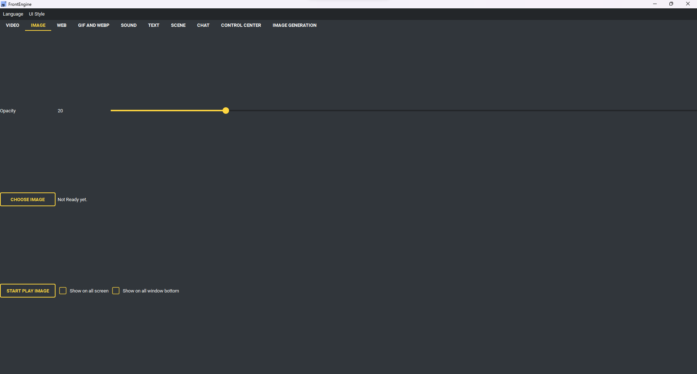

Pagina Immagine
---------------

* Scegli immagine - l'immagine da mostrare.
* Mostra immagine.
* Opacità - quanto l'immagine è trasparente.
* Schermo intero - allargare a tutto lo schermo.
* Mostra su tutti gli schermi - una copia per monitor.
* Mostra sotto tutte le finestre - collocarla sotto le altre finestre.
* Presentazione - mostrare a turno ogni immagine di una cartella.

    * Scegli cartella - dove stanno le immagini.
    * Intervallo - secondi per immagine.
    * Casuale - ordine mescolato.
    * Includi le sottocartelle.

* Schermo di destinazione - quale schermo usare, o chiedere ogni volta.
* Recenti - le immagini già mostrate.
* Apri tavola di riferimento… - scegliere più immagini insieme e disporle su
  un'unica superficie sopra la scrivania. Trascina ciascuna per disporla, lo sfondo
  per spostarti, rotellina per lo zoom, Canc toglie quella selezionata ed Esc
  chiude la tavola. Anche il Centro di controllo le raggiunge.

Immagine → Confronta immagini mostra due riferimenti in una vista con zoom e spostamento comuni: affiancati, sovrapposti con trasparenza, con separatore scorrevole o differenza assoluta RGB. Allinea in alto a sinistra o al centro senza ridimensionare, oppure adatta B in A mantenendo le proporzioni. La rotella ingrandisce entrambi; il cursore regola opacità di B o separatore. Trasparenza e margini sono confrontati su bianco; nero indica RGB identici. Si usa solo il primo fotogramma animato. Decodifica, allineamento e calcolo avvengono in background con una richiesta alla volta e solo l’ultima selezione applicata; opacità/separatore riutilizzano le immagini. Limiti: 64 MiB per file, 8.192 pixel per lato e 16.777.216 pixel per immagine/tela. Un errore conserva la coppia precedente; chiudendo si liberano le immagini e si ignorano i risultati tardivi.
