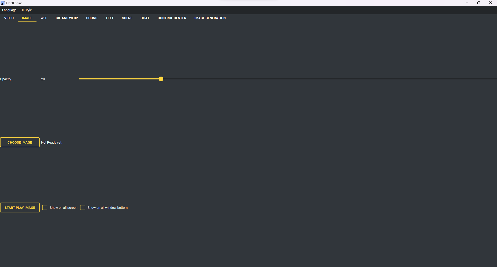

Изображение
-----------

* Выбрать изображение - какую картинку показать.
* Показать изображение.
* Непрозрачность - насколько картинка просвечивает.
* Полный экран - растянуть на весь экран.
* Показывать на всех экранах - по копии на монитор.
* Показывать под всеми окнами - разместить ниже прочих окон.
* Слайд-шоу - показывать все картинки из папки по очереди.

    * Выбрать папку - где лежат картинки.
    * Интервал - сколько секунд на картинку.
    * В случайном порядке.
    * Включая вложенные папки.

* Целевой экран - какой экран использовать или спрашивать каждый раз.
* Недавние - ранее показанные картинки.
