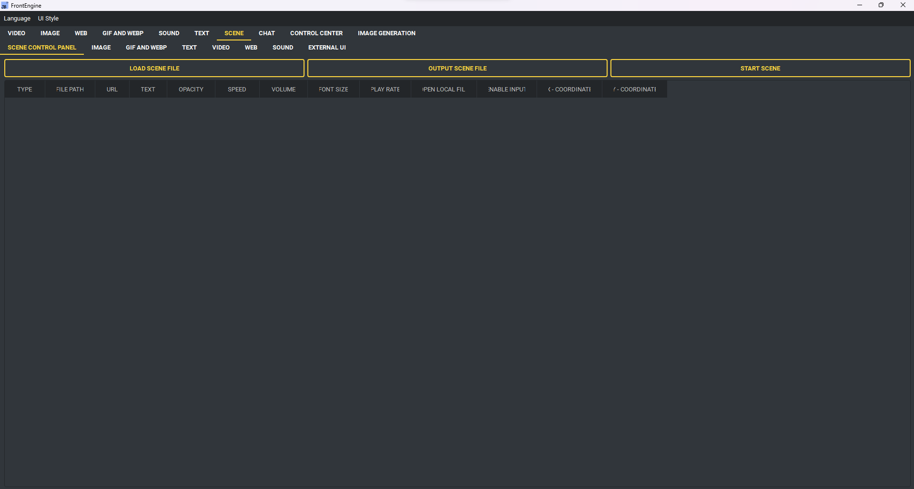

Сцена
-----

Сцена держит сразу несколько слоёв и сохраняется в файл.

* Добавить веб-страницу - адрес и непрозрачность.
* Добавить видео - файл, непрозрачность, скорость, громкость.
* Добавить изображение - файл и непрозрачность.
* Добавить GIF - файл, непрозрачность, скорость.
* Добавить звук - файл и громкость.
* Добавить текст - текст, непрозрачность, размер шрифта, выравнивание.
* Запустить сцену - показать всё добавленное.
* Сохранить файл сцены.
* Загрузить файл сцены - вернуть сохранённую сцену.
* Очистить все сценарии - начать заново.
* Показывать на всех экранах - по копии на монитор.
