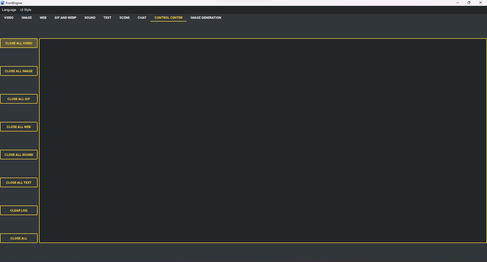

Control Center Page
----

* 控制面板有一個區域用於顯示錯誤訊息並控制其他實例。
    * 「關閉所有影片」按鈕將關閉所有影片實例。
    * 「關閉所有圖片」按鈕將關閉所有圖片實例。
    * 「關閉所有 GIF」按鈕將關閉所有 GIF 實例。
    * 「關閉所有網頁」按鈕將關閉所有網頁。
    * 「關閉所有音效」按鈕將關閉所有正在播放的音效實例。
    * 「清除所有文字」將清除屏幕上的所有文字。
    * 「清除日誌」將清除錯誤訊息區域。
    * 「關閉所有」將關閉所有實例。