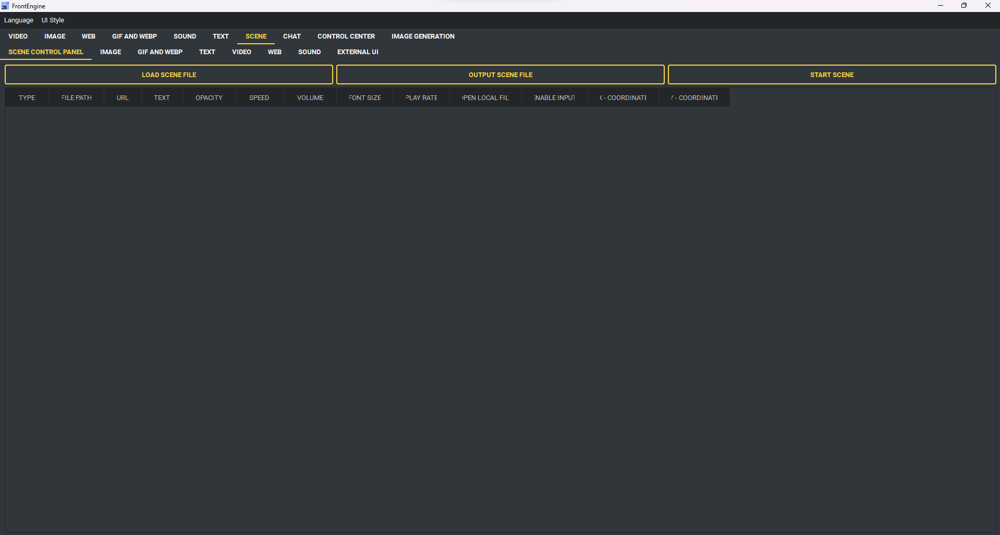

場景頁面
----

當您切換到場景選項卡時，您會注意到它下方有一個子選項卡。
場景選項卡允許您同時播放多個場景。

以下是可用選項的詳細說明：

* 場景控制面板：
    * 查看您已加載的場景數量。
    * 儲存場景檔案。
    * 開始所有場景。
* 圖片：
    * 將圖片場景添加到場景檔案中。
* GIF 和 WEBP：
    * 在場景檔案中包含GIF和WEBP場景。
* 文字：
    * 將文字場景添加到場景檔案中。
* 影片：
    * 添加影片場景至場景檔案中。
* 網頁：
    * 將網頁場景添加到場景檔案中。
* 音效：
    * 在場景檔案中添加音效場景。
* 外部UI：
    * 將外部UI場景添加到場景檔案中。