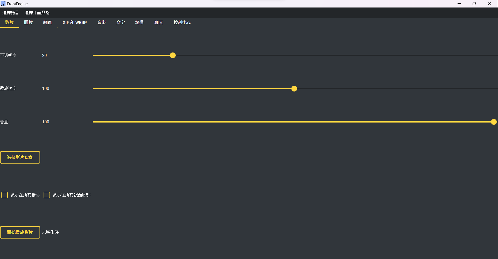

怎麼使用 UI
----

* 選擇語言選單 (選擇使用者介面語言)
* 選擇介面風格 (選擇使用者介面風格)
* 分頁選單
    * 影片 (設定並顯示影片在前景)
    * 圖片 (設定並顯示圖片在前景)
    * 網頁 (設定並顯示網頁在前景)
    * GIF 和 WEBP (設定並顯示 GIF 或 WEBP 在前景)
    * 音樂 (設定並撥放音樂)
    * 文字 (設定並顯示文字在前景)
    * 場景 (添加多個組件並同時顯示多個組件，可以把設定存為檔案)
    * 聊天 (在前景與 Bing 助手聊天)
    * 控制中心 (控制所有其他組件)
