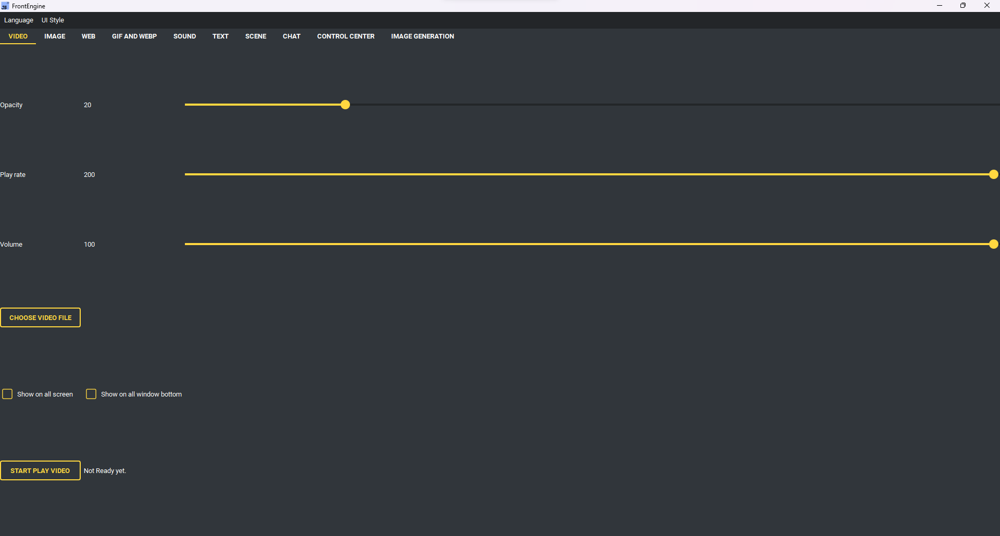

影片頁面
--------

* 選擇影片檔 - 挑要播放的檔案。
* 開始播放影片 - 顯示它。
* 不透明度 - 影片有多透明。
* 播放速度 - 播放的快慢。
* 音量 - 聲音大小。
* 全螢幕 - 拉伸到整個螢幕。
* 顯示在所有螢幕 - 每個螢幕各一份。
* 顯示在所有視窗底下 - 放到其他視窗之下。
* 目標螢幕 - 要用哪個螢幕，或每次詢問。
* 最近使用 - 之前播過的檔案。
