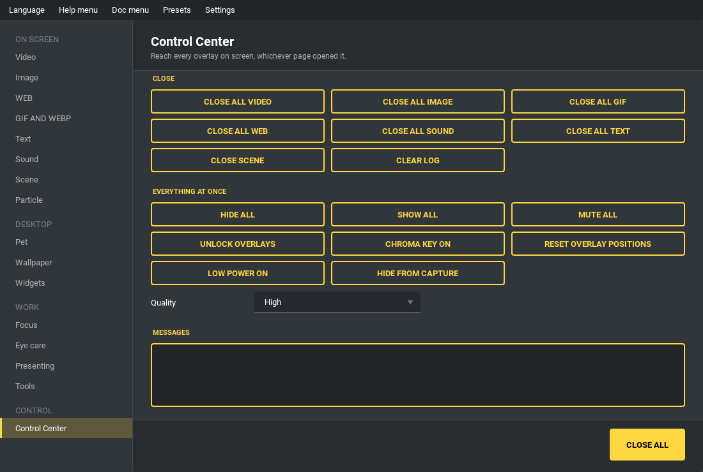

控制中心页面
------------

这一页能碰到所有覆盖层，包含其他页面打开的那些。

关闭

* 关闭所有视频／图片／GIF／网页／音效／文字 - 只关那一类。
* 关闭所有 - 关掉画面上每一个覆盖层，不管是哪一页打开的。
* 清除日志 - 清空右侧的消息区。

整批操作

* 全部隐藏 / 全部显示 - 暂时收起来，再调回来。
* 全部静音 - 让所有会出声的东西安静。
* 锁定 / 解除锁定覆盖层 - 解除锁定后可以用鼠标把覆盖层拖到想要的位置，
  松开时位置会被记住；锁定时则让点击穿透。
* 抠像色 - 把背景涂成单一颜色，方便在 OBS 之类的软件里抠像。
* 重置覆盖层位置 - 全部摆回一开始的地方。
* 省电模式 - 在意电池时降低刷新率与渲染分辨率。
* 画质 - 高、平衡、省电，是上面那件事更细的版本。
* 从画面捕获中隐藏 - 覆盖层留在你自己的屏幕上，但不会出现在屏幕共享的结果里。
  仅 Windows 有效。专注页的遮挡层会保持可见——遮住东西正是它唯一的用途。
