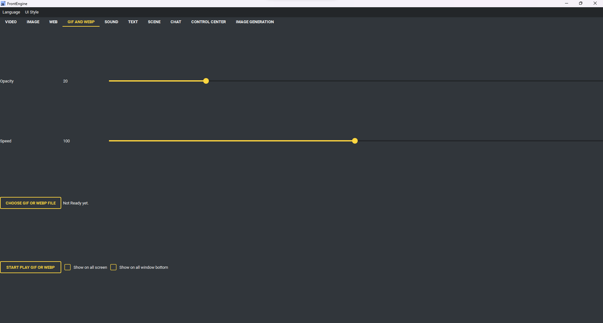

GIF 和 WEBP 页面
----------------

* 选择 GIF 或 WEBP 文件 - 挑要播放的动画。
* 开始播放 GIF 或 WEBP - 显示它。
* 不透明度 - 动画有多透明。
* 速度 - 播放的快慢。
* 全屏 - 拉伸到整个屏幕。
* 显示在所有屏幕 - 每个屏幕各一份。
* 显示在所有窗口底下 - 放到其他窗口之下。
* 目标屏幕 - 要用哪个屏幕，或每次询问。
* 最近使用 - 之前播放过的动画。
