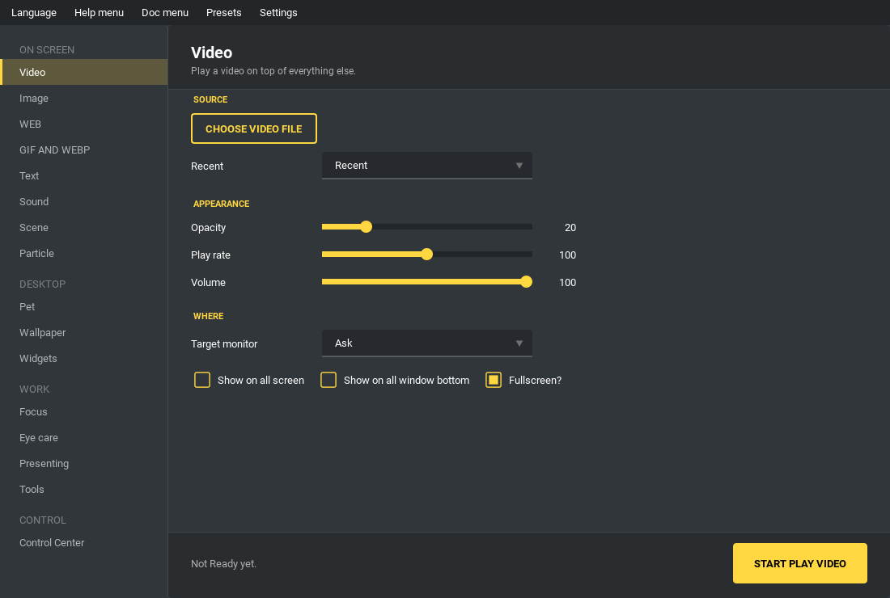

如何使用
--------

FrontEngine 把东西放在你的画面最上层——视频、图片、网页、文字、桌面宠物——
并且在你继续工作的时候一直留在那里。每一个这样的东西叫做「覆盖层」。你可以
同时打开很多个，来自不同页面、放在不同屏幕上。

打开第一个覆盖层
================

1. 在左边的列表里挑一页，看你想放什么：视频、图片、网页、文字等等。
   列表按用途分组，相关的页面会放在一起。
2. 选好文件，或输入网址。
3. 按那一页的开始按钮。

它会出现在所有东西之上，直到你把它关掉为止。你做其他事情不会不小心把它收走。

每个页面共通的设置
==================

大部分页面都有同样的几个控件，而且在哪一页意思都一样：

* **不透明度** - 桌面透出来多少。覆盖层默认偏透明，是为了叠在你的工作上而不是
  把它盖掉。
* **目标屏幕** - 要用哪个屏幕。设成「每次询问」就会每次问你。
* **显示在所有屏幕** - 每个屏幕各放一份，而不是只有一个。
* **显示在所有窗口底下** - 把覆盖层压到窗口之下，像背景而不是挡在前面的东西。
* **最近使用** - 之前用过的文件，不用再找一次。

覆盖层不会挡路
==============

点击会直接穿透覆盖层落到底下的东西上，所以下面的窗口照常可以操作。有两个东西
本来就需要鼠标，因此是例外：宠物，以及演示页在涂鸦开启时的涂鸦层。

一次管理很多个
==============

**控制中心**\ 页面能碰到每一个覆盖层，不管是哪一页打开的。它可以一次全部隐藏、
全部静音、锁定、重置位置，或在意电池时降低画质。想把某一个拖到别的位置，
要先解除锁定——松开的地方它会记住。

把画面清干净
============

控制中心的「关闭所有」会一次关掉全部，也可以到「设定」→「快捷键」绑一个全局
快捷键。万一有东西没有反应，按 **F12** 会立刻关闭 FrontEngine。

菜单栏
======

* **选择语言** - 七种语言：English、繁體中文、简体中文、Deutsch、Русский、
  Français、Italiano。切换后界面立刻改变，不需要重新启动，已经打开的东西也都留在原地。

  第一次启动时，如果装了 Steam 而且 Steam 设置的是这七种之一，FrontEngine
  就会用那个语言打开，而不是英文。这只会发生一次：你在这里挑过语言之后，
  就以你挑的为准。Steam 是在本机读取的——不需要账号、不联网，也不会发送
  任何东西。
* **选择 UI 样式** - 配色主题，也可以让它按日夜自动切换。
* **预设** - 把各页面的设置整组取名保存，之后再调回来。见 :doc:`menus`。
* **设定** - 快捷键、开机启动、智能暂停、应用情境、提醒、看板模式、手机遥控、
  屏幕共享隐私、屏幕使用时间与剪贴板历史。同样见 :doc:`menus`。
* **帮助** - 「使用说明…」会在程序里打开一份简短的指引，内容和这一页涵盖的范围
  相同。里面还有问题反馈，以及 F12 的提醒。
* **文档** - 在浏览器里打开这份文档。

页面
====

把东西放到画面上

* :doc:`video`、:doc:`image`、:doc:`web`、:doc:`gif_and_webp`、:doc:`sound`、
  :doc:`text` - 一种页面放一种东西。
* :doc:`scene` - 把好几种组合起来，保存为文件。
* :doc:`particle` - 在桌面上撒粒子效果。
* :doc:`pet` - 会走动、爬墙、对你有反应的伙伴。

让自己工作得舒服一点

* :doc:`screen_care` - 屏幕滤镜、阅读尺、休息提醒、色觉模拟。
* :doc:`focus` - 调暗背景，或把会分心的东西遮起来。
* :doc:`wallpaper` - 位于所有窗口之下的动态壁纸。

把画面给别人看的时候

* :doc:`presentation` - 屏幕涂鸦、光标强调、按键显示、放大镜、白板。
* :doc:`tools` - 测量、截图、读取文字、录屏、虚拟摄像头、摄像头、窗口置顶。
* :doc:`widgets` - 音频频谱、系统监控、正在播放、便签。

再加上 :doc:`control_center`，一次指挥以上全部。
